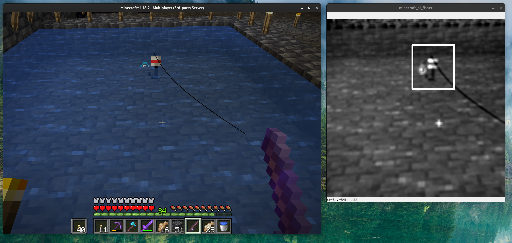

## Computer Vision Automated Fishing in Minecraft

---

### What is this?

This program will try to track the fishing bobber in the water in Minecraft.
Once the bobber moves down a significant amount of pixels, the right mouse is clicked on a defined place on the screen.

Feel free to change the program, tune parameters, play around improve upon this **_lazy_** solution.

---

### Why?

I'm lazy.

---

### Run

Run the `run.sh` shell script to initialize the Python virtual
environment, install the dependencies and start the program.

Place your minecraft window somewhere on your screen and change the `rect` on line `49` in `main.py`

---

### Screenshots

